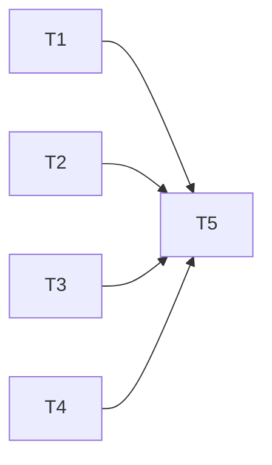

# Plan: Documentation Projet Source d'Anahata

> **Specs**: .backlog/tasks/2026-04-11-documentation-projet/spec.md
> **Created on**: 2026-04-11
> **Status**: Awaiting validation

## Metrics

- **Total tasks**: 5
- **Waves**: 2
- **Max parallelization**: 4 simultaneous agents
- **Overall complexity**: M
- **Estimated agent time**: 3h30 (sequential)
- **Estimated parallel time**: 1h30 (with parallelization)

## Overview

Creation of a `docs/` folder containing four thematic documentation files (README, architecture, content, contribution guide) covering the Hugo static site "Source d'Anahata". All four files are fully independent and can be written in parallel. Once the `docs/` files exist, CLAUDE.md is updated to add collaboration rules and a reference to the new documentation.

## Dependency Diagram



---

## Wave 1 (Parallel - No dependencies)

**Objective**: Create all four documentation files in `docs/`
**Estimated duration**: 1h (longest individual task)

| ID | Task | Agent | Complexity | Estimate | Files | Dependencies |
|----|------|-------|------------|----------|-------|--------------|
| T1 | Create docs/README.md | ux-designer | S | 30min | `docs/README.md` | - |
| T2 | Create docs/architecture.md | ux-designer | M | 1h | `docs/architecture.md` | - |
| T3 | Create docs/contenu.md | ux-designer | M | 1h | `docs/contenu.md` | - |
| T4 | Create docs/guide-contribution.md | ux-designer | M | 1h | `docs/guide-contribution.md` | - |

### T1: Create docs/README.md

**Agent**: ux-designer
**Complexity**: S (< 30min)

**Description**:
Create the entry point for the project documentation. This file introduces the project to any reader (human or AI) with no prior knowledge. It must cover: what the site is (wellness institute, showcase website), the production URL (https://institut-source-anahata.fr), the technical stack (Hugo SSG, Tailwind CSS via CDN, Congo theme as submodule, Go templates, JSON data, Markdown content, Google Fonts Cardo), the absence of backend/database/tests, and links to the three other doc files (architecture.md, contenu.md, guide-contribution.md).

**Affected files**:
- `docs/README.md` - create

**Validation**:
- [ ] Project name, URL and purpose are clearly stated
- [ ] Full tech stack is listed (Hugo, Tailwind, Congo, Go templates, JSON, Markdown)
- [ ] Links to architecture.md, contenu.md, and guide-contribution.md are present
- [ ] No backend/test assumptions

---

### T2: Create docs/architecture.md

**Agent**: ux-designer
**Complexity**: M (1h)

**Description**:
Document the project structure and technical architecture. Must include:

1. Folder tree with a one-line description of each folder: `config/_default/` (Hugo config: hugo.toml, params.toml, menus.toml), `content/` (Markdown pages), `data/` (JSON data files), `layouts/` (Go templates and partials), `assets/` (images, 17 JPEG files), no `static/` folder (all assets go through Hugo pipeline).

2. Data flow: `content/*.md` frontmatter references a `data_file` key -> Hugo reads `data/<file>.json` -> rendered by `layouts/_default/prestation.html` which dispatches to `layout-simple.html` or `layout-complex.html`.

3. Layout system: `baseof.html` (shell: head, navbar, main, footer), `index.html` (homepage), `prestation.html` (dispatch simple vs complex), `rendez-vous.html` (Planity widget). Partials: `navbar.html`, `footer.html`, `carousel.html`, `hero-banner.html`, `exclusivity.html`, `services.html`, `layout-simple.html`, `layout-complex.html`.

4. Color system: Tailwind tokens defined in `config/_default/params.toml` and injected via a JS bridge in `baseof.html`. Rule: NEVER hardcode colors. Tokens: primary #6BDDB0, light #DDF7EC, dark #00C27B, background #FDFBF7 (default) / #F4F0E6 (paper), text #3D3D3D (main) / #71717A (muted), button bg #3D3D3D / text #FFFFFF.

5. Known limitations: hamburger menu present but mobile dropdown not functional; opening hours hardcoded in `hero-banner.html`; Planity API key hardcoded in `rendez-vous.html`.

**Affected files**:
- `docs/architecture.md` - create

**Validation**:
- [ ] Folder tree is present with descriptions
- [ ] Data flow (content -> data -> layout) is explained
- [ ] All layout files are listed with their role
- [ ] Color token system and the "never hardcode" rule are documented
- [ ] Known limitations section is present

---

### T3: Create docs/contenu.md

**Agent**: ux-designer
**Complexity**: M (1h)

**Description**:
Document all content and data of the site. Must cover:

1. Page inventory (7 pages in `content/`): `_index.md` (homepage), `soins-corps.md` (prestation, data: soin-corps), `visage.md` (prestation, data: soin-visage), `epilations.md` (prestation, data: epilation), `beaute-du-regard.md` (prestation, data: beaute-du-regard), `onglerie.md` (prestation, data: onglerie), `rendez-vous.md` (reservation page, Planity widget).

2. Data file inventory (9 JSON files in `data/`): `soin-corps.json` (complex layout, 5 univers: Le Ressourcant, L'Eveil d'Agnisia, Rituels du Monde, Maderosport, Les Essentiels), `soin-visage.json` (complex layout, 3 univers: Magic Face, Phyt's Bio, Biodroga), `epilation.json` (simple layout, 14 prestations), `beaute-du-regard.json` (simple layout, 5 prestations), `onglerie.json` (simple layout, 7 prestations), `insitut-presentation.json` (homepage hero — note: typo in filename, do not rename), `prestations.json` (homepage services grid, 5 cards), `offre-exclusive.json` (current offers / Nouveautes), `offre-exclusive_old.json` (archive, unused).

3. JSON data models with annotated examples:
   - Simple: `{ "title": "", "layout": "simple", "images": [], "prestations": [{ "title": "", "description": "", "price": "" }] }`
   - Complex: `{ "title": "", "layout": "complex", "images": [], "univers": [{ "name": "", "description": "", "image": "", "prestations": [{ "title": "", "description": "", "price": "", "options": [] }] }] }`

**Affected files**:
- `docs/contenu.md` - create

**Validation**:
- [ ] All 7 content pages are listed with their data file reference
- [ ] All 9 JSON data files are listed with their role and layout type
- [ ] Both data models (simple and complex) are documented with field descriptions
- [ ] The filename typo `insitut-presentation.json` is noted without recommending a rename

---

### T4: Create docs/guide-contribution.md

**Agent**: ux-designer
**Complexity**: M (1h)

**Description**:
Write a step-by-step contribution guide for the site. Must cover:

1. Adding a new prestation page (end-to-end): create `content/<slug>.md` with frontmatter (layout, title, data_file), create `data/<slug>.json` following either the simple or complex model, add a menu entry in `config/_default/menus.toml`, add an image to `assets/images/` following the naming convention `nom-orientation.jpg`.

2. Modifying colors: edit the color values in `config/_default/params.toml` only. Never hardcode colors directly in templates. The JS bridge in `baseof.html` injects them into the Tailwind config automatically.

3. Modifying navigation: edit `config/_default/menus.toml` (name, url, weight fields).

4. Modifying exclusive offers (Nouveautes): edit `data/offre-exclusive.json`.

5. Conventions:
   - Formatting: Prettier with `.prettierrc` settings (printWidth 120, tabWidth 2, no tabs, semicolons, double quotes, no trailing commas)
   - Commits: conventional commits (feat, fix, docs, style, refactor)
   - Image naming: `nom-orientation.jpg` (e.g., `soin-corps-portrait.jpg`)
   - Hugo image processing: use `resources.Get` pipeline, no `static/` folder
   - No backend, no tests, no CI pipeline

**Affected files**:
- `docs/guide-contribution.md` - create

**Validation**:
- [ ] Step-by-step guide for adding a new prestation is present (content + data + menu + image)
- [ ] Color modification workflow references params.toml only
- [ ] Navigation modification references menus.toml
- [ ] Exclusive offers modification references offre-exclusive.json
- [ ] All conventions (Prettier, commits, image naming) are documented

---

## Wave 2 (Sequential - Depends on Wave 1)

**Objective**: Update CLAUDE.md with collaboration rules and reference to docs/
**Estimated duration**: 30min

| ID | Task | Agent | Complexity | Estimate | Files | Dependencies |
|----|------|-------|------------|----------|-------|--------------|
| T5 | Modify CLAUDE.md | ux-designer | S | 30min | `CLAUDE.md` | T1, T2, T3, T4 |

### T5: Modify CLAUDE.md

**Agent**: ux-designer
**Complexity**: S (< 30min)

**Description**:
Update the existing `CLAUDE.md` file with two additions:

1. Add a new section `## Regles de collaboration` before the existing `## INSTRUCTION PRIORITAIRE` section. This section must contain the two collaboration rules:
   - Rule 1: Always read the relevant `docs/` file before modifying or creating any content or template (read `docs/architecture.md` before touching layouts, read `docs/contenu.md` before touching data files, etc.).
   - Rule 2: Never hardcode colors in templates — always use Tailwind tokens defined in `config/_default/params.toml`.

2. In the existing `## Structure du projet` section (or directly after it), add a reference to the `docs/` folder: indicate that detailed documentation is available in `docs/` with links to `docs/README.md`, `docs/architecture.md`, `docs/contenu.md`, and `docs/guide-contribution.md`.

Do NOT modify the `<!-- agent-factory:start -->` ... `<!-- agent-factory:end -->` block. Do NOT modify `## INSTRUCTION PRIORITAIRE`. Only add the new section and the docs reference.

**Affected files**:
- `CLAUDE.md` - modify (add section + reference)

**Validation**:
- [ ] `## Regles de collaboration` section exists with both rules
- [ ] Reference to `docs/` folder is present in CLAUDE.md
- [ ] The `agent-factory` block is untouched
- [ ] The `## INSTRUCTION PRIORITAIRE` section is untouched

---

## Critical Path

```
T2 or T3 or T4 (1h) -> T5 (30min) = 1h30
```

T1 (30min) finishes before the Wave 1 bottleneck. The critical path is driven by any of the three M-complexity doc files followed by T5.

---

## Identified Risks

| Risk | Impact | Probability | Mitigation |
|------|--------|-------------|------------|
| Agent writes inaccurate data about JSON models | Medium | Low | Exploration files provide exact model structures; agent must copy them verbatim |
| Agent renames `insitut-presentation.json` typo | Medium | Low | Spec and T3 description explicitly forbid renaming |
| Agent modifies the `agent-factory` block in CLAUDE.md | High | Low | T5 description explicitly marks the block as untouchable |
| Over-documentation (dump of every template line) | Low | Medium | Spec states "niveau de detail: essentiel" — agents must stay at overview level |

---

## Notes for the Orchestrator

- Wave 1 has 4 fully independent tasks: launch all 4 subagents simultaneously.
- The `docs/` folder does not exist yet; agents must create it.
- T5 must only start after all four Wave 1 tasks report COMPLETED.
- The ux-designer agent is used for all tasks because this is a pure documentation task with no code generation; developer agents are not needed.
- The exploration files in `.backlog/tasks/2026-04-11-documentation-projet/exploration/` are the authoritative source of truth for all technical details.
- The existing `CLAUDE.md` content must be read by the T5 agent before editing (mandatory pre-read rule).

---

## Wave 1 Execution (start immediately):

```
Task(subagent_type="agent-factory:design:ux-designer", prompt="T1: Create docs/README.md
CONTEXT: Task documentation-projet, Specs: /Users/maxence.liboz/Documents/source-anahata/.backlog/tasks/2026-04-11-documentation-projet/spec.md, Exploration: /Users/maxence.liboz/Documents/source-anahata/.backlog/tasks/2026-04-11-documentation-projet/exploration/
ACTION: Create the file /Users/maxence.liboz/Documents/source-anahata/docs/README.md. This is the entry point of the project documentation. It must cover: what the site is (wellness institute Source d'Anahata, showcase website), the production URL https://institut-source-anahata.fr, the full tech stack (Hugo SSG, Tailwind CSS via CDN, Congo theme as git submodule, Go templates, JSON data files, Markdown content, Google Fonts Cardo), the absence of backend/database/tests, and links to the three other doc files (architecture.md, contenu.md, guide-contribution.md). Level of detail: essential, human-readable and usable as AI reference.
DELIVERABLES: /Users/maxence.liboz/Documents/source-anahata/docs/README.md
POST-ACTION: Mark T1 COMPLETED in /Users/maxence.liboz/Documents/source-anahata/.backlog/tasks/2026-04-11-documentation-projet/plan.md")

Task(subagent_type="agent-factory:design:ux-designer", prompt="T2: Create docs/architecture.md
CONTEXT: Task documentation-projet, Specs: /Users/maxence.liboz/Documents/source-anahata/.backlog/tasks/2026-04-11-documentation-projet/spec.md, Exploration: /Users/maxence.liboz/Documents/source-anahata/.backlog/tasks/2026-04-11-documentation-projet/exploration/
ACTION: Create the file /Users/maxence.liboz/Documents/source-anahata/docs/architecture.md documenting the project structure and technical architecture. Must include: (1) folder tree with descriptions (config/_default/, content/, data/, layouts/, assets/ — no static/ folder); (2) data flow: content/*.md frontmatter data_file key -> data/<file>.json -> layouts/_default/prestation.html -> dispatch to layout-simple.html or layout-complex.html; (3) layout system: all files in layouts/ with their role (baseof.html, index.html, prestation.html, rendez-vous.html, navbar.html, footer.html, carousel.html, hero-banner.html, exclusivity.html, services.html, layout-simple.html, layout-complex.html); (4) color system: tokens in config/_default/params.toml injected via JS bridge in baseof.html — NEVER hardcode colors — list all token values (primary #6BDDB0, light #DDF7EC, dark #00C27B, background #FDFBF7 / #F4F0E6, text #3D3D3D / #71717A, button bg #3D3D3D / text #FFFFFF); (5) known limitations: mobile dropdown not functional, opening hours hardcoded in hero-banner.html, Planity API key hardcoded in rendez-vous.html. Level of detail: essential.
DELIVERABLES: /Users/maxence.liboz/Documents/source-anahata/docs/architecture.md
POST-ACTION: Mark T2 COMPLETED in /Users/maxence.liboz/Documents/source-anahata/.backlog/tasks/2026-04-11-documentation-projet/plan.md")

Task(subagent_type="agent-factory:design:ux-designer", prompt="T3: Create docs/contenu.md
CONTEXT: Task documentation-projet, Specs: /Users/maxence.liboz/Documents/source-anahata/.backlog/tasks/2026-04-11-documentation-projet/spec.md, Exploration: /Users/maxence.liboz/Documents/source-anahata/.backlog/tasks/2026-04-11-documentation-projet/exploration/
ACTION: Create the file /Users/maxence.liboz/Documents/source-anahata/docs/contenu.md documenting all content and data. Must include: (1) page inventory — 7 pages: _index.md (homepage), soins-corps.md (data: soin-corps), visage.md (data: soin-visage), epilations.md (data: epilation), beaute-du-regard.md (data: beaute-du-regard), onglerie.md (data: onglerie), rendez-vous.md (Planity); (2) data file inventory — 9 JSON files: soin-corps.json (complex, 5 univers), soin-visage.json (complex, 3 univers), epilation.json (simple, 14 prestations), beaute-du-regard.json (simple, 5), onglerie.json (simple, 7), insitut-presentation.json (homepage hero — note the typo in filename, do NOT rename), prestations.json (homepage services grid, 5 cards), offre-exclusive.json (current offers), offre-exclusive_old.json (archive, unused); (3) both JSON data models documented with field descriptions — simple: { title, layout, images[], prestations[]: { title, description, price } } — complex: { title, layout, images[], univers[]: { name, description, image, prestations[]: { title, description, price, options[]? } } }.
DELIVERABLES: /Users/maxence.liboz/Documents/source-anahata/docs/contenu.md
POST-ACTION: Mark T3 COMPLETED in /Users/maxence.liboz/Documents/source-anahata/.backlog/tasks/2026-04-11-documentation-projet/plan.md")

Task(subagent_type="agent-factory:design:ux-designer", prompt="T4: Create docs/guide-contribution.md
CONTEXT: Task documentation-projet, Specs: /Users/maxence.liboz/Documents/source-anahata/.backlog/tasks/2026-04-11-documentation-projet/spec.md, Exploration: /Users/maxence.liboz/Documents/source-anahata/.backlog/tasks/2026-04-11-documentation-projet/exploration/
ACTION: Create the file /Users/maxence.liboz/Documents/source-anahata/docs/guide-contribution.md as a step-by-step contribution guide. Must cover: (1) adding a new prestation page end-to-end: create content/<slug>.md (frontmatter: layout, title, data_file), create data/<slug>.json (simple or complex model), add menu entry in config/_default/menus.toml (name, url, weight), add image to assets/images/ (naming: nom-orientation.jpg); (2) modifying colors: edit config/_default/params.toml only, never hardcode in templates; (3) modifying navigation: edit config/_default/menus.toml; (4) modifying exclusive offers (Nouveautes): edit data/offre-exclusive.json; (5) conventions: Prettier (.prettierrc — printWidth 120, tabWidth 2, no tabs, semicolons, double quotes, no trailing commas), conventional commits (feat, fix, docs, style, refactor), image naming nom-orientation.jpg, Hugo image pipeline via resources.Get (no static/ folder), no backend/tests/CI.
DELIVERABLES: /Users/maxence.liboz/Documents/source-anahata/docs/guide-contribution.md
POST-ACTION: Mark T4 COMPLETED in /Users/maxence.liboz/Documents/source-anahata/.backlog/tasks/2026-04-11-documentation-projet/plan.md")
```

## Wave 2 Execution (after Wave 1 completion — T1, T2, T3, T4 all COMPLETED):

```
Task(subagent_type="agent-factory:design:ux-designer", prompt="T5: Modify CLAUDE.md — add collaboration rules and docs reference
CONTEXT: Task documentation-projet, Specs: /Users/maxence.liboz/Documents/source-anahata/.backlog/tasks/2026-04-11-documentation-projet/spec.md
ACTION: Read /Users/maxence.liboz/Documents/source-anahata/CLAUDE.md first, then make two additions: (1) Add a new section '## Regles de collaboration' before the '## INSTRUCTION PRIORITAIRE' section with two rules — Rule 1: always read the relevant docs/ file before modifying content or templates (docs/architecture.md before touching layouts, docs/contenu.md before touching data files, docs/guide-contribution.md before adding a prestation) — Rule 2: never hardcode colors in templates, always use Tailwind tokens defined in config/_default/params.toml; (2) In or after the '## Structure du projet' section, add a reference stating that detailed documentation is available in docs/ with links to docs/README.md, docs/architecture.md, docs/contenu.md, and docs/guide-contribution.md. CRITICAL: do NOT modify or touch the agent-factory block (<!-- agent-factory:start --> to <!-- agent-factory:end -->) and do NOT modify '## INSTRUCTION PRIORITAIRE'.
DELIVERABLES: /Users/maxence.liboz/Documents/source-anahata/CLAUDE.md (modified)
POST-ACTION: Mark T5 COMPLETED in /Users/maxence.liboz/Documents/source-anahata/.backlog/tasks/2026-04-11-documentation-projet/plan.md")
```

---

## Changelog

| Date | Modification | Author |
|------|-------------|--------|
| 2026-04-11 | Initial creation | Planner |
